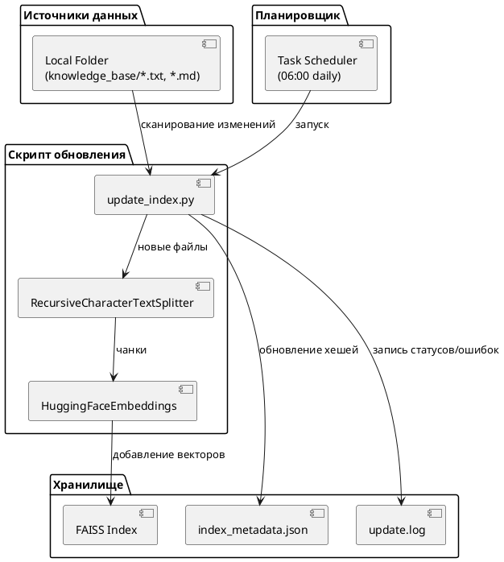

# Задание 6. Автоматическое ежедневное обновление базы знаний

## Обновление

```python
python update_index.py
```

## Настройка Планировщика заданий Task Scheduler на Windows

1. `Win + R` → `taskschd.msc` →  **Создать задачу** **.**
2. **Общие**
   * Имя: `RAG_Update_Index`
   * ✅ Выполнять вне зависимости от входа пользователя
   * ✅ Выполнить с наивысшими правами
3. **Триггеры** → Создать → Ежедневно, 06:00.
4. **Действия** → Создать → Запуск программы
   * **Программа:** полный путь к Python в виртуальном окружении:
     `C:\Users\binom\...\task6_rag_update\.venv\Scripts\python.exe`
   * **Аргументы:** полный путь к скрипту
     `C:\Users\binom\...\task6_rag_update\update_index.py`
   * **Начать в:** папка проекта
     `C:\Users\binom\...\task6_rag_update`
5. **Условия** → Снимите ✅ Запускать только при питании от сети.
6. **Параметры**
   * При неудачном запуске: Повторять каждые `5 мин`, до `3 раз`.
   * Остановить, если выполняется дольше: 2 ч.
   * ✅ Включить журнал.

## Диаграмма потока данных



## Пример лога

[update_2026-04-25_(2-files) (0_errors).log](update_2026-04-25_(2-files) (0_errors).log)
