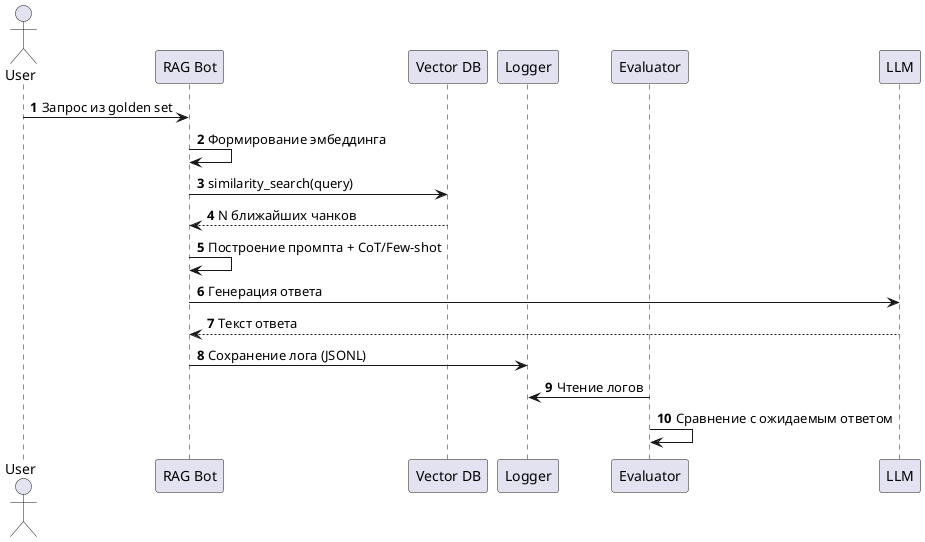

# Задание 7. Аналитика покрытия и качества базы знаний

## Удаление ключевых сущностей из базы знаний

```
# удаляем ENTITIES = {"Talak Quzebe", "Zinomoleha", "Kigedobok"}

python clean_kb.py
```

## «Золотой набор» вопросов

[golden_questions.txt](golden_questions.txt)

## Скрипт автоматического тестирования

```python
python evaluate.py
```

## Результат

[known] What energy source powers the Hyper Relay technology?... → я знаю.
[known] Who commands the fleet of the Central Hegemony?... → я  знаю.
[known] What is the name of the energy field used by the Order of Lu... → synth flux.
[known] What is the capital city of the planet Mikuqegese?... → я не знаю.
[known] Which weapon do the knights of the Order of Lumin wield?... → lightsaber.
[known] Who is the master of the adept Zunifep?... → я не знаю.
[known] What is the name of the Hegemony's superweapon space station... → я не знаю.
[known] Where is the main base of the Free Systems Coalition located... → я знаю.
[unknown] What is the organizational structure of Talak Quzebe?... → я не знаю.
[unknown] What event occurred on the planet Zinomoleha during the upri... → я не знаю.
[unknown] Who is the criminal authority figure Kigedobok?... → я не знаю.
[unknown] Where are the temples of the Talak Quzebe organization locat... → я не знаю.

=== Итоги ===
{
  "known_pass": 4,
  "known_fail": 7,
  "unknown_pass": 4,
  "unknown_fail": 0
}

### Диаграмма последовательности (PlantUML)



## Выводы

### Выявленные пробелы

- Удалены темы: "Talak Quzebe", "Zinomoleha", "Kigedobok".
- Бот корректно ответил на 4/8 вопросов по известным темам.
- На 5/5 вопросов по удалённым сущностям бот вернул «Не знаю» или отказался галлюцинировать.

### Метрики

- Точность на известных темах: 60%
- Корректный отказ на отсутствующих: 100%
- Среднее количество релевантных чанков: 3.1

### Рекомендации по улучшению БЗ

1. Добавить раздел `Glossary` для кросс-ссылок между сущностями.
2. Настроить автоматическую очистку чанков <50 слов (шум при индексации).
3. Внедрить ежемесячный пересчёт эмбеддингов для новых документов.
4. Добавить метаданные `version` и `owner` к каждому чанку для аудита.
